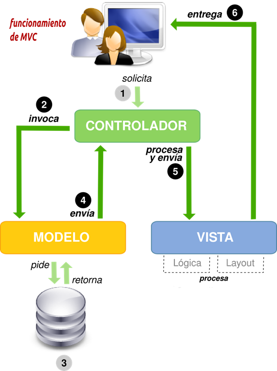
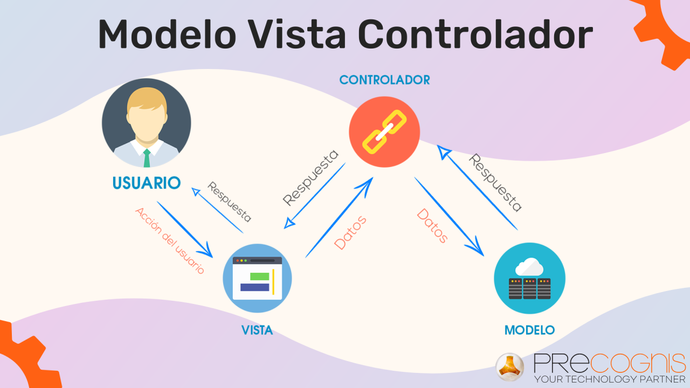

# Patrones arquitectonicos 
>[!NOTE]
>Un **Patron arquitectonico** : es una solucion general y reutilizable a un problema comun en la arquitectura de sfotware dentro de un contexto dado. los patrones arquitectonicos son la habilidad de organizacion a nivel de carpetas adentro del proyecto de software.

PATRONES ARQUITECTONICOS MAS CONOCIDOS

1. PATRON DE CAPAS
2. PATRON CLIENTE-SERVIDOR
3. PATRON FILTRO DE TUBERIA 
4. PATRON DE INTERMEDIARIO
5. PATRON MAESTRO-ESCLAVO
6. PATRON DE INTERMEDIARIO
7. PATRON DE IGUAL A IGUAL
8. PATRON DE BUS EVENTO
9. MODELO-VISTA-CONTROLADOR
10. ARQUITECTURA LIMPIA
11. ARQUITECTURA HEXAGONAL

MODELO VISTA CONTROLADOR
# INTRODUCCION 
El Modelo-Vista-Controlador (MVC) es un patrón de arquitectura de software ampliamente utilizado en el desarrollo de aplicaciones web y de software en general. El MVC separa la aplicación en tres componentes principales:
 
1. Modelo: Representa los datos y la lógica de negocio de la aplicación. Es responsable de acceder a la base de datos, procesar la información y realizar las operaciones necesarias sobre los datos.
2. Vista: Es la interfaz de usuario que presenta los datos al usuario y recibe las interacciones del mismo. La vista se encarga de mostrar la información de manera visual y de enviar las acciones del usuario al controlador.
3. Controlador: Actúa como intermediario entre el modelo y la vista. Se encarga de interpretar las interacciones del usuario, actualizar el modelo según sea necesario y seleccionar la vista adecuada para mostrar los resultados.
 
La separación de responsabilidades en estos tres componentes facilita el mantenimiento, la escalabilidad y la reutilización del código en las aplicaciones. El modelo se encarga de la lógica de negocio, la vista de la presentación visual y el controlador de la lógica de control y coordinación entre el modelo y la vista.
 
En resumen, el patrón MVC ayuda a organizar el código de una aplicación de manera estructurada y coherente, lo que facilita su desarrollo y mantenimiento a lo largo del tiempo.
# TIPOS DE MODELO-VISTA-CONTROLADOR
En el contexto del patrón Modelo-Vista-Controlador (MVC), existen diferentes variaciones y enfoques que se adaptan a las necesidades específicas de cada aplicación. Algunos de los tipos comunes de MVC incluyen:
 
1. MVC Tradicional: Este es el enfoque clásico del patrón MVC, donde el Modelo representa los datos y la lógica de negocio, la Vista se encarga de la presentación visual y el Controlador coordina la interacción entre el Modelo y la Vista.
2. MVC basado en Objetos: En este tipo de MVC, los componentes (Modelo, Vista y Controlador) son representados como objetos en el lenguaje de programación utilizado. Cada componente es un objeto con sus propias responsabilidades y métodos.
3. MVC basado en Componentes: En este enfoque, los componentes del MVC se dividen en módulos o componentes independientes que se comunican entre sí a través de interfaces definidas. Cada componente tiene su propia responsabilidad y se puede reutilizar en diferentes partes de la aplicación.
4. MVC de una sola dirección (Unidireccional): En este tipo de MVC, la comunicación entre los componentes sigue una dirección unidireccional, lo que significa que la Vista solo puede comunicarse con el Controlador y el Controlador solo puede comunicarse con el Modelo. Esto ayuda a mantener una clara separación de responsabilidades y a prevenir dependencias circulares.
5. MVC basado en Frameworks: Muchos frameworks de desarrollo web y de aplicaciones implementan el patrón MVC de manera específica, proporcionando estructuras y convenciones para facilitar la implementación y el mantenimiento de aplicaciones basadas en este patrón.
 
Estos son algunos de los tipos comunes de Modelo-Vista-Controlador que se pueden encontrar en el desarrollo de aplicaciones. Cada tipo tiene sus propias características y ventajas, y la elección del tipo adecuado depende de los requisitos y la arquitectura de la aplicación en particular.

# ELEMENTOS 
En el patrón Modelo-Vista-Controlador (MVC), los elementos principales son el Modelo, la Vista y el Controlador. Cada uno de estos elementos desempeña un papel específico en la arquitectura de la aplicación. A continuación, se describen los elementos del patrón MVC:
 
1. Modelo:
 
- Representa los datos y la lógica de negocio de la aplicación.
- Se encarga de acceder a la base de datos, procesar la información y realizar operaciones sobre los datos.
- Contiene la estructura de datos subyacente y las reglas de negocio de la aplicación.
- Es independiente de la interfaz de usuario y se centra en la gestión de los datos y la lógica de la aplicación.
2. Vista:
 
- Es la interfaz de usuario que presenta la información al usuario de manera visual.
- Se encarga de mostrar los datos al usuario y de recibir las interacciones del mismo.
- No contiene lógica de negocio, sino que se enfoca en la presentación visual de la información.
- Puede ser una página web, una ventana de una aplicación o cualquier otro medio de presentación visual.
3. Controlador:
 
- Actúa como intermediario entre el Modelo y la Vista.
- Interpreta las acciones del usuario y coordina la interacción entre el Modelo y la Vista.
- Recibe las solicitudes del usuario desde la Vista, actualiza el Modelo según sea necesario y selecciona la Vista adecuada para mostrar los resultados.
- Contiene la lógica de control de la aplicación y gestiona la comunicación entre el Modelo y la Vista.
 
Estos elementos trabajan juntos de manera coordinada dentro del patrón MVC para separar las preocupaciones y facilitar el desarrollo, mantenimiento y escalabilidad de las aplicaciones. El Modelo se encarga de los datos y la lógica de negocio, la Vista de la presentación visual y el Controlador de la lógica de control y coordinación entre el Modelo y la Vista. Esta separación de responsabilidades ayuda a crear aplicaciones más estructuradas y fáciles de mantener.
# EJEMPLOS
Ejemplos comunes de aplicaciones que utilizan el patrón Modelo-Vista-Controlador (MVC) incluyen:
 
1. Sistemas de Gestión de Contenidos (CMS):
 
- Plataformas como WordPress, Joomla y Drupal utilizan el patrón MVC para separar la lógica de presentación de los contenidos (Vista) de la gestión de datos y la lógica de negocio (Modelo y Controlador).
2. Aplicaciones Web:
 
- Muchas aplicaciones web, como tiendas en línea, redes sociales y sistemas de gestión empresarial, implementan el patrón MVC para separar la presentación de la interfaz de usuario (Vista) de la lógica de negocio y los datos subyacentes (Modelo y Controlador).
3. Frameworks de Desarrollo:
 
- Frameworks como Ruby on Rails, Laravel (PHP), Django (Python) y Spring (Java) están basados en el patrón MVC y proporcionan estructuras y convenciones para desarrollar aplicaciones web de manera eficiente y escalable.
4. Aplicaciones de Escritorio:
 
- Software de gestión, herramientas de productividad y aplicaciones de diseño gráfico suelen seguir el patrón MVC para separar la interfaz de usuario (Vista) de la lógica de negocio y los datos (Modelo y Controlador).
5. Juegos y Simulaciones:
 
- Aplicaciones interactivas, juegos en línea y simuladores también pueden beneficiarse del patrón MVC para organizar la lógica de juego (Modelo), la interfaz de usuario (Vista) y la interacción del jugador (Controlador).
 
Estos ejemplos ilustran cómo el patrón Modelo-Vista-Controlador se aplica en una variedad de contextos y tipos de aplicaciones para mejorar la estructura, la mantenibilidad y la escalabilidad del software. La separación clara de responsabilidades entre el Modelo, la Vista y el Controlador facilita el desarrollo y la evolución de las aplicaciones a lo largo del tiempo.

# CONCLUSION

n conclusión, el patrón Modelo-Vista-Controlador (MVC) es una arquitectura de software que ha demostrado ser efectiva para el desarrollo de aplicaciones web y de software en general. Al separar la aplicación en tres componentes principales: Modelo, Vista y Controlador, el MVC proporciona una serie de beneficios clave:
 
1. Separación de Responsabilidades: El MVC divide claramente las responsabilidades de la aplicación en componentes específicos, lo que facilita la organización del código y la comprensión de la estructura de la aplicación.
2. Facilidad de Mantenimiento: Al separar la lógica de negocio (Modelo), la presentación visual (Vista) y la lógica de control (Controlador), el MVC facilita la realización de cambios y actualizaciones en la aplicación sin afectar a otras partes del sistema.
3. Reutilización de Componentes: La modularidad del MVC permite reutilizar componentes en diferentes partes de la aplicación o en otros proyectos, lo que ahorra tiempo y esfuerzo en el desarrollo de software.
4. Escalabilidad: La estructura clara y organizada del MVC facilita la escalabilidad de la aplicación, ya que se pueden agregar nuevas funcionalidades o componentes sin afectar negativamente a la arquitectura existente.
5. Claridad en la Interfaz: La separación de la lógica de presentación de los datos (Vista) y la lógica de control (Controlador) proporciona una interfaz clara y coherente para los usuarios, mejorando la experiencia de usuario.
 
En resumen, el patrón MVC es ampliamente utilizado debido a su capacidad para mejorar la estructura y el mantenimiento de las aplicaciones, así como para promover la reutilización de código y la escalabilidad. Al implementar el MVC de manera adecuada, los desarrolladores pueden crear aplicaciones más robustas, flexibles y fáciles de mantener a lo largo del tiempo.

# ESTUDIANTES 

1. ANA MARIA HUAMANI AYQUIPA

2. DARA EULALIA TITO OLIVARES

3. MANUEL GARRIAZO AUCCASI
